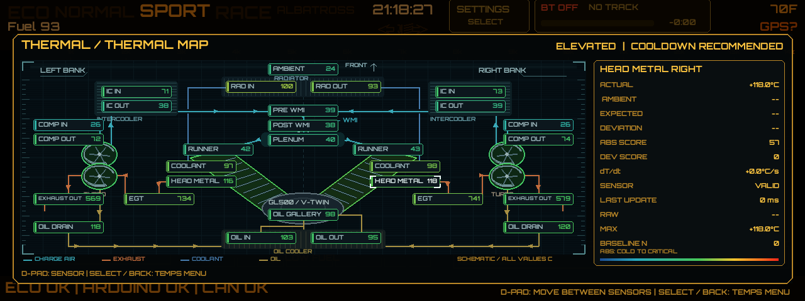

# Albatross thermal subsystem

The dedicated `THERMAL_NODE` is a second Teensy 4.1. It acquires and validates 32 configured channels, performs sensor conversion and fast per-channel IIR filtering, propagates hardware faults, and broadcasts a versioned binary CAN protocol. The Pi owns derived metrics, condition-relative models, exposure logs, and the HUD. The existing controller and MS3 keep safety authority.

## Hardware boundary

The complete [thermal Teensy pin map and 32-channel connector assignment](../arduino/README.md#dedicated-thermal-teensy-pin-map)
are maintained in the firmware README. This is a physically separate board:
SPI 11/12/13, MAX31856 CS 10/9/8/7, ADS7953 CS 6/5, CAN1 RX/TX 22/23.
The current configuration enables 29 of the 32 stable sensor IDs; three are reserved.

- CAN remains 500 kbit/s, 11-bit identifiers, through a 3.3 V automotive CAN transceiver. Terminate only at the two physical bus ends.
- Four K-type probes use four MAX31856-class cold-junction-compensated front ends. Never wire a thermocouple to a Teensy ADC. Use K extension wire and connectors through the cold-junction point.
- Two ADS7953 16-channel SPI ADCs provide 32 analog inputs. Each installed circuit requires the calibration network named in `config/thermal_system.json`, a stable reference/excitation supply, RC filtering, series/current limiting, ESD and load-dump/transient protection, and a low-noise sensor return.
- PT1000 channels assume a precision 500 µA excitation circuit. NTC channels use the profile-specific precision pull-up. The firmware constants are initial engineering values and must be calibrated against the actual selected probes and conditioning PCB.
- Keep thermocouple and analog harnesses separated from ignition, injectors, starter/stator wiring, DBW, wastegate actuators, WMI pump, Air Shot solenoids, and other switched-current wiring.
- `AMBIENT_AIR` must be shielded from radiator discharge, exhaust radiation, sunlight, and heated bodywork.

## Safety ownership

Primary coolant, MAT/IAT, and any ECU-required EGT remain directly available to MS3/main control. The Pi is never in the protection chain. The main Teensy consumes valid supplemental thermal values directly and enters an explicit degraded state when the thermal heartbeat is absent: boost is capped at 8 psi, CAN-level flame intent and Air Shot are inhibited, while independent WMI and ECU protections remain available. Flame implementation remains intentionally provisional and has no dedicated Teensy output pin. A valid supplemental critical temperature requests the existing thermal limp path. Invalid channels never become `0°C`.

Before vehicle use, review thresholds with the engine builder/tuner, prove every failure mode on a bench, validate CAN loading, and verify that disconnecting the Pi does not remove overtemperature protection.

## Pi architecture

See the [thermal error catalogue and Ignore Error controls](thermal_alerts.md)
for main-HUD warning conditions, audio mapping, clearing and recurrence behavior.

`albatross_pi/thermal/service.py` is the single live model. SocketCAN, simulation, and JSONL replay all feed this model. It owns timestamps, stale/offline behavior, component-specific ABS normalization, ambient deltas, left/right and stage deltas, intercooler effectiveness, diagnostic compressor-efficiency estimates, filtered derivatives, persistent/hysteretic alerts, and protected condition bins.

Baseline learning starts disabled. It must be deliberately authorized only during known-healthy commissioning. Factory, long-term, and recent dictionaries remain separate so degradation cannot silently redefine the only good baseline.

Select the System Vitals window to open TEMPS. ECO/NORMAL use a compact TEMP tile beside Air Shot instead; its label changes color with thermal condition and its subtext reports the operating/fault state. Merely hovering never opens the menu. Up/down in the menu chooses Overview, Thermal Map, Thermal Δ / DEV, Intake / Turbos, Engine / Cooling, Oil System, Sensor Status, or History / Logs; Select opens the page. ABS answers “what is hot”; DEV answers “what is behaving unusually.”

Heat maps display all 29 active sensors on a functional overhead schematic of the twin-turbo transverse V-twin: a forward radiator, mirrored intercoolers and compressor/turbine housings, shared pre/post-WMI and plenum, separate runners and projecting cylinder banks, central crankcase, oil cooler and turbo oil drains. Charge-air/exhaust arrows show direction; coolant and oil connections are schematic, not a fabrication drawing or a specified pump/thermostat installation. Cylinder/scroll outlines and sensor callouts use measured thermal colors, with unavailable readings gray. Turbo drain temperatures are fluid temperatures, not the disabled CHRA housing sensors.

While either heat map is open, animated arrows travel along the charge-air, exhaust and turbo-drain paths. Both rotor drawings on each turbo share a smoothly changing phase: more bank boost means faster visual rotation; missing bank pressure falls back to common boost. Invalid common pressure uses the slow idle visual speed. Motion is a presentation-only **boost proxy, not measured shaft RPM or proof of fluid flow**; that explanation stays in documentation rather than on the HUD. Presentation constants are bounded separately from engineering calibrations, and animation does not issue commands or alter thermal alerts. Coolant paths remain unarrowed because exact circulation plumbing is unspecified.

The map uses a restrained avionics treatment: a chamfered bezel, subtle background raster with a slow CRT sweep, edge graduations and steady corner brackets on the selected sensor. The sweep stays behind components and sensor text, and data and alert colors retain their meaning. Cylinder fins are derived from the same bank polygons as the castings, inset within each bank and mirrored together; `tests/run_thermal_geometry_checks.py` guards their alignment.

All four D-pad directions select a visible neighbor, preferring nearby aligned sensors and stopping at the edge. Navigation and rendering share the same sensor coordinates. The selected sensor remains selected when switching ABS/DEV pages. Select or Back returns to the TEMPS menu; Back from that menu returns to the vitals/TEMP tile. Tests in `tests/run_thermal_navigation_checks.py` cover menu entry, all five drive modes, complete sensor reachability, non-overlapping callout geometry at 1280×480 and 1920×720, and animation bounds, fallback and timing.

## Commissioning sequence

Synthetic 1280×480 architecture preview (sample temperatures; indicative component placement):



1. Run `py -3.12 tools/check_thermal_config.py` and resolve all drift.
2. Power the acquisition PCB without probes. Confirm every installed channel reports an explicit open/front-end fault.
3. Apply known resistances and thermocouple simulator points at cold, operating, warning, and critical temperatures. Record calibration residuals.
4. Confirm channel IDs and physical labels one connector at a time.
5. Confirm heartbeat loss produces `THERMAL NODE OFFLINE`, unavailable values, the main-controller degraded cap, and no fabricated temperatures.
6. Exercise every built-in simulator scenario before first engine operation.
7. Keep baseline learning disabled until the tuner explicitly marks operating regions healthy.

## Development commands

```text
py -3.12 tests/run_thermal_checks.py
py -3.12 tests/run_thermal_navigation_checks.py
py -3.12 tools/check_thermal_config.py
py -3.12 main.py --simulator --thermal-scenario full_boost_pull
```

Optional offline animation preview (requires Pygame and Pillow, opens no CAN/network connection): `py -3.12 tools/render_thermal_motion.py thermal-motion.gif`. The synthetic 0–20 psi sweep demonstrates visual spool-up/down only; it is not calibration or test evidence for the motorcycle.

Thermal logs are written independently of the selected page under `logs/thermal`. Every record carries the configuration version and vehicle-state context.
